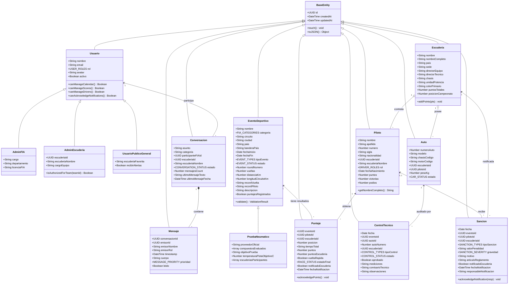

# Mapeo y Complemento del Diagrama de Clases - FIA 2026

El siguiente esquema detalla las clases presentes en el diagrama conceptual suministrado, complementadas con los atributos requeridos para el cumplimiento completo del Enunciado 1 de la FIA (gestión de categorías F1/F2/F3/F1 Academy, pruebas de neumáticos, roles de usuario, controles técnicos, sanciones y mensajería interna).

---

## 1. Diagrama de Clases (Mermaid)

---

## 2. Complementos Realizados a las Clases del Diagrama
1. **`EventoDeportivo`**: Se incorporaron atributos de metadatos de carrera (`distanciaKm`, `vueltas`, `longitudCircuitoKm`, `recordVuelta`, `recordPiloto`, `banderaPais`, `puntajesRegistrados`) y validación de negocio.
2. **`PruebaNeumatico`**: Especialización de `EventoDeportivo` con atributos reglamentarios de Pirelli Motorsport (`compuestosEvaluados`, `proveedorOficial`, `temperaturaPistaObjetivoC`).
3. **`Piloto`**: Se añadió el atributo `rol` (`Titular` / `Suplente / Reserva`) para cumplir explícitamente con el requerimiento de carga de pilotos de las escuderías.
4. **`ControlTecnico`**: Se añadieron `mediciones`, `comisarioTecnico` y `tipoControl` (peso mínimo, alerón, combustible, desgaste de plancha).
5. **`Sancion`** y **`Puntaje`**: Se integraron los atributos de trazabilidad legal de notificación (`notificadoEscuderia`, `fechaNotificacion`, `responsableNotificacion`), requeridos por la FIA.
6. **`Conversacion`** y **`Mensaje`**: Se implementó con `prioridad`, `timestamp`, `emisorRol` y seguridad TLS simulada.
