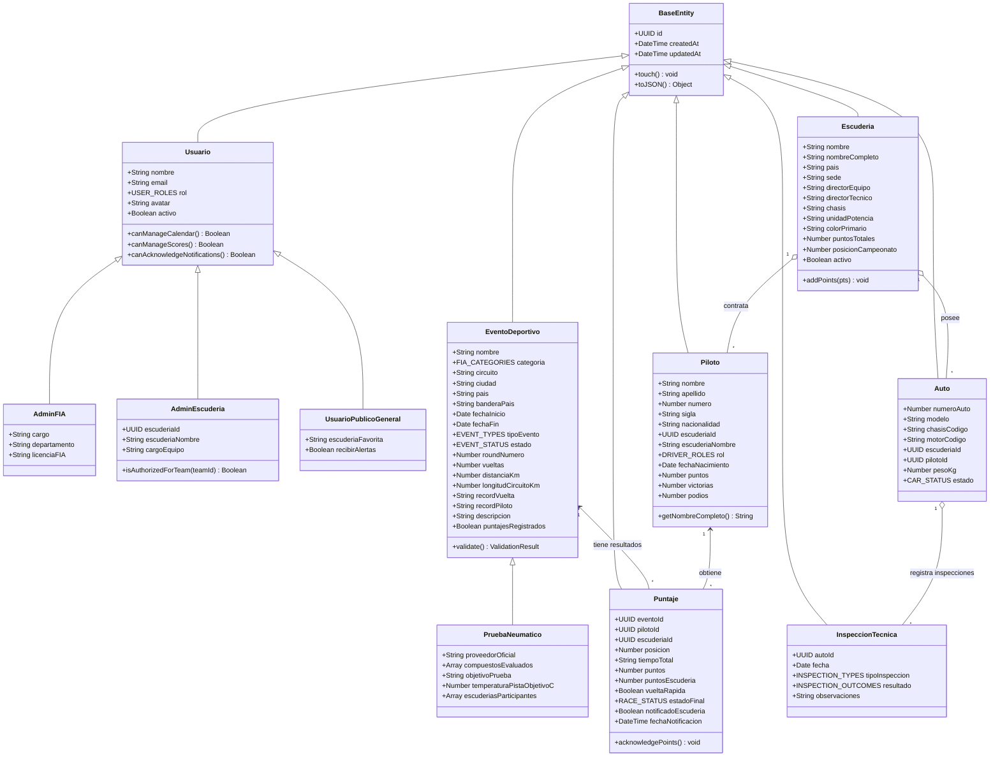

# Mapeo y Complemento del Diagrama de Clases - FIA 2026

El siguiente esquema detalla las clases presentes en el diagrama conceptual suministrado, complementadas con los atributos requeridos para el cumplimiento completo del Enunciado 1 de la FIA (gestión de categorías F1/F2/F3/F1 Academy, pruebas de neumáticos y roles de usuario).

---

## 1. Diagrama de Clases (Mermaid)

---

## 2. Complementos Realizados a las Clases del Diagrama
1. **`EventoDeportivo`**: Se incorporaron atributos de metadatos de carrera (`distanciaKm`, `vueltas`, `longitudCircuitoKm`, `recordVuelta`, `recordPiloto`, `banderaPais`, `puntajesRegistrados`) y validación de negocio.
2. **`PruebaNeumatico`**: Especialización de `EventoDeportivo` con atributos reglamentarios de Pirelli Motorsport (`compuestosEvaluados`, `proveedorOficial`, `temperaturaPistaObjetivoC`).
3. **`Piloto`**: Se añadió el atributo `rol` (`Titular` / `Suplente / Reserva`) para cumplir explícitamente con el requerimiento de carga de pilotos de las escuderías.
4. **`Puntaje`**: Se integraron los atributos de trazabilidad legal de notificación (`notificadoEscuderia`, `fechaNotificacion`), requeridos por la FIA y el esquema oficial de puntuación 2026 (sin bonificación por vuelta rápida).
